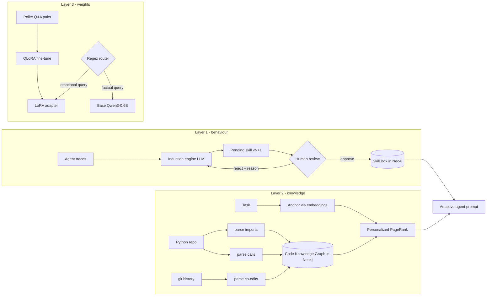

# Adaptive Agent Lab

A small, working lab for **adaptive AI agents**: agents that get better at the
same work from one day to the next, instead of rediscovering yesterday's fix
every morning.

Built with **Python + Neo4j + Qwen**, and deliberately without an agent
framework: every stage is a short, named script that writes an inspectable
artifact before anything touches the database or a model.

## Why

Picture a coding agent on Monday. You ask it to run your tests; it tries
`pytest`, hits `ModuleNotFoundError`, investigates, and discovers the fix
(`python -m pytest` from the repo root). On Tuesday you open a fresh chat, ask
the same thing — and it burns the same time and tokens hitting the same error,
because nothing carried forward.

This project closes that gap with three adaptation layers, ordered from
cheapest to most expensive:

| Layer | What adapts | Where it lives | Cost |
|---|---|---|---|
| 1. Behaviour | Skills induced from traces, gated by human review | Neo4j (`:Skill`, `:Episode`) | ~free |
| 2. Knowledge | A Code Knowledge Graph of the repo (imports / calls / co-edits) | Neo4j (`:CodeFile`, `:CodeFunction`) | cheap |
| 3. Weights | A QLoRA adapter fine-tuned on top of Qwen3-0.6B | `artifacts/polite_adapter/` (~40 MB) | expensive |

Layers 1–2 are **token-space** adaptation (better context in, better behaviour
out). Layer 3 is **weight-space** adaptation, reserved for what context cannot
fix — tone, format, persona, refusals.

## Architecture



The agent demo (stage 10) retrieves the best approved skill and the
graph-ranked file hints, injects both into the prompt, and answers through a
Qwen chat model. The router (stage 09) shows weight-space adaptation serving
alongside the base model.

## Repository layout

```
adaptive-agent-lab/
├── adaptive_agent/            # the package - all logic lives here
│   ├── config.py              # every setting, resolved from env, inspectable
│   ├── llm.py                 # thin OpenAI-compatible chat client (Ollama/Qwen by default)
│   ├── embeddings.py          # sentence-transformers, lazy-loaded, normalised vectors
│   ├── graph_db.py            # Neo4j driver + run_read/run_write; Cypher stays at call sites
│   ├── agent.py               # payoff: skill + graph hints -> prompt -> answer
│   ├── skills/                # LAYER 1 - behaviour adaptation
│   │   ├── models.py          #   Step / Episode / Skill dataclasses
│   │   ├── trace_store.py     #   episodes <-> Neo4j
│   │   ├── skill_box.py       #   versioned skills + embedding retrieval
│   │   ├── induction.py       #   the LLM contract + proposal writer
│   │   └── review.py          #   the human approve/reject gate
│   ├── ckg/                   # LAYER 2 - knowledge adaptation
│   │   ├── parse_imports.py   #   ast -> file-to-file import edges
│   │   ├── parse_calls.py     #   ast -> function-to-function call edges
│   │   ├── parse_co_edits.py  #   git log -> co-edit edges
│   │   ├── build_graph.py     #   JSON artifacts -> Neo4j property graph
│   │   ├── pagerank.py        #   personalized PageRank, plain power iteration
│   │   └── retrieve.py        #   anchor + PPR vs keyword baseline
│   └── finetune/              # LAYER 3 - weight adaptation
│       ├── build_dataset.py   #   seed + LLM-generated polite pairs -> jsonl
│       ├── train_qlora.py     #   QLoRA on Qwen3-0.6B, explicit tokenise/collate
│       ├── compare.py         #   base vs adapter, side by side
│       └── router.py          #   regex router: which model answers?
├── scripts/                   # numbered stages - run top to bottom
│   ├── 01_seed_skills.py      ├── 06_query_ckg.py
│   ├── 02_load_traces.py      ├── 07_build_polite_dataset.py
│   ├── 03_induce_skill.py     ├── 08_train_adapter.py
│   ├── 04_review_skill.py     ├── 09_route_and_answer.py
│   ├── 05_build_ckg.py        └── 10_agent_demo.py
├── data/
│   ├── sample_traces.json     # synthetic traces incl. a 3x repeated failure
│   ├── seed_skills/*.md       # five v1 skills with front-matter headers
│   └── polite_seed.json       # 12 handwritten polite Q&A pairs
├── artifacts/                 # generated: parser JSON, dataset, adapter (gitignored)
├── requirements.txt
└── .env.example
```

## Prerequisites

- **Python 3.11+**
- **Neo4j 5.x** — easiest via Docker:

  ```bash
  docker run -d --name neo4j -p 7474:7474 -p 7687:7687 -e NEO4J_AUTH=neo4j/please-change-me neo4j:5
  ```

- **A chat LLM endpoint** — default is local [Ollama](https://ollama.com)
  running Qwen:

  ```bash
  ollama pull qwen3:4b
  ```

  Any OpenAI-compatible endpoint works: set `LLM_BASE_URL`, `LLM_API_KEY`,
  `LLM_MODEL` in `.env`.
- **Optional, for stage 08**: a CUDA GPU for 4-bit QLoRA. Without one, pass
  `--no-4bit` (Qwen3-0.6B is small enough to fine-tune on CPU with patience,
  or on any free-tier cloud GPU).

## Setup

```bash
git clone https://github.com/prashant-fintech/adaptive-agent-lab.git
cd adaptive-agent-lab
python -m venv .venv && . .venv/bin/activate   # Windows: .venv\Scripts\activate
pip install -r requirements.txt
cp .env.example .env                            # then edit credentials
```

## Walkthrough

### Layer 1 — skill induction (stages 01–04)

```bash
python scripts/01_seed_skills.py      # five v1 skills into the Skill Box
python scripts/02_load_traces.py      # episodes incl. the same failure hit 3x
python scripts/03_induce_skill.py     # LLM distils traces -> pending v2
python scripts/04_review_skill.py     # inspect v1 vs v2 side by side
python scripts/04_review_skill.py --approve --note "folds in the proven -m fix"
```

The sample traces contain the same failure three times (`pytest` →
`ModuleNotFoundError`) plus its proven fix. The induction engine proposes a v2
`run-the-tests` skill that folds the fix into the procedure — but the skill
only becomes retrievable after a human approves it. Rejections require a
reason, and the engine reads that reason on its next attempt.

### Layer 2 — the Code Knowledge Graph (stages 05–06)

```bash
python scripts/05_build_ckg.py --repo .        # parse THIS repo into Neo4j
python scripts/06_query_ckg.py "where do we walk the graph edges?"
```

Stage 05 writes three inspectable artifacts (`artifacts/ckg_imports.json`,
`ckg_functions.json` + `ckg_calls.json`, `ckg_co_edits.json`) before loading
them into Neo4j. Stage 06 prints the keyword baseline and the graph retrieval
(anchor via embeddings → personalized PageRank → blended score) for the same
query, with the score breakdown per node — so you can see *why* each node
ranked, and where the graph finds related files that share no keyword with the
query.

### Layer 3 — weight-space adaptation (stages 07–09)

```bash
python scripts/07_build_polite_dataset.py --seed-only   # or --n 500 via the LLM
python scripts/08_train_adapter.py                      # add --no-4bit without CUDA
python scripts/09_route_and_answer.py "Ugh, my tests keep failing!" --compare
```

Stage 08 freezes all of Qwen3-0.6B and trains only LoRA matrices (~1–2% of
parameters, prompt tokens masked from the loss). Stage 09's router sends
emotional/courteous queries to the polite adapter and factual ones to the base
model — the routing rule that fired is printed with the decision.

### The payoff (stage 10)

```bash
python scripts/10_agent_demo.py "Run the project's test suite and report failures"
```

The agent retrieves the *approved* skill (with its similarity score), the
graph-ranked file hints (with their PPR/cosine breakdown), injects both into
the prompt, and answers. Tomorrow's agent starts where today's finished.

## Design principles

- **Every stage writes an artifact you can read.** Parsers emit JSON before
  the database sees anything; the dataset is a JSONL you can open; routing
  decisions name the rule that fired; retrieval results carry all three
  scores.
- **No fused stages, no framework magic.** The PageRank is a visible power
  iteration; the Cypher lives at the call site so you can paste it into Neo4j
  Browser; the fine-tune tokenisation and collation are written out, not
  hidden in a trainer wrapper.
- **Humans gate behaviour.** An induced skill is a *proposal* until a person
  approves it — that's the defence against a wrong or poisoned trace becoming
  permanent agent behaviour.

## Where to take it

- Point stage 05 at a bigger repo and eyeball the multi-hop wins in stage 06.
- Re-run stages 02–04 with your own agent's real traces.
- Train additional adapters (formats, refusal policies, brand voice) and grow
  the router from regex rules to a learned classifier.
- Close the loop: re-parse the graph on every merge (`--keep-existing` off) —
  appending new nodes is nearly free.

## Companion write-up

The full story behind this lab — why retrieval is the bottleneck, why the
human gate exists, and when to touch the weights — is on my blog:
[Adaptive AI agents: three layers of memory, from a Neo4j graph to Qwen's
weights](https://singhprashant.in/writing/adaptive-ai-agents-neo4j-qwen).

## Acknowledgements

The three-layer framing (behaviour → knowledge → weights) and the experiment
design follow the DeepLearning.AI short course on adaptive AI agents; the
course builds on an Oracle stack, and this lab re-implements the ideas from
scratch on Neo4j with Qwen models throughout. In the course's benchmarks
(HTTPie, Django), injecting code-knowledge-graph hints into a coding agent's
context improved time-on-task, tool calls and tokens by roughly 10–18%.

## License

MIT — see [LICENSE](LICENSE).
